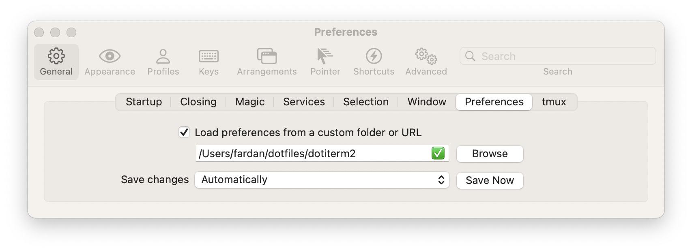

This repo contains my settings for iTerm2.

## Installation
1.  Clone this repo into a local directory (e.g., `~/dotfiles/dotiterm2`).
2.  In iTerm2's settings, go to General > Preferences.
3.  Enable "Load preferences from a custom folder or URL", enter the path
    to your local clone of this repo, and select "Automatically" for "Save
    Changes":
    
4.  Restart iTerm2.
